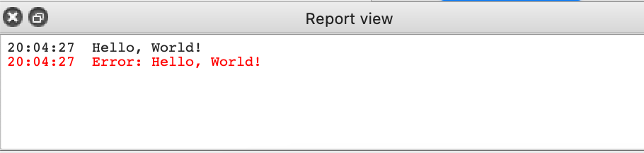

# FreeCAD Beginner Assistant (FreeCAD Addon)
The FreeCAD Beginner Assistant analyses a FreeCAD FCStd-file containing at least one part made with the Part Design and Sketcher workbenches and gives realtime or asynchronous feedback, based on best practices, on what was done well and what can be improved by the user.

## Installation
1. Download this repo
2. Copy the folder "FreeCAD-Beginner-Assistant" to "<FreeCAD>/Mod"
3. Run FreeCAD (The Addon is automatically recognized at startup)

## License
[LGPLv2.1](https://github.com/alekssadowski95/FreeCAD-Beginner-Assistant/blob/main/LICENSE) for all FreeCAD Beginner Assistant content

## Contact
* For questions, comments, feature requests, improvements, please open issue at: [issue tracker](https://github.com/alekssadowski95/FreeCAD-Beginner-Assistant/issues)
* Also we can discuss at: (TODO: create FreeCAD forum thread for this project)

## Vision
- Get asynchronous feedback with best practises in FCViewer.
- Get realtime feedback with best practises in FreeCAD.

-> Increase the quality of community-created projects and increase the popularity of FreeCAD as a result.
