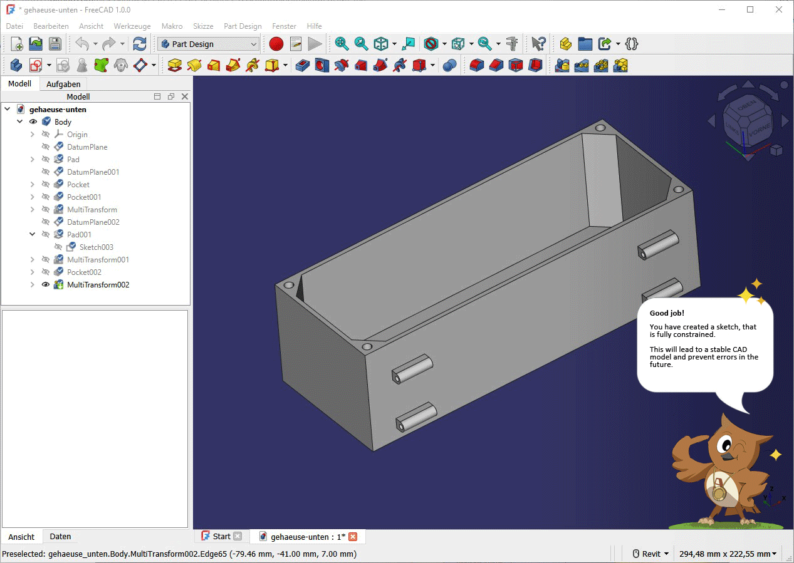

# FreeCAD Beginner Assistant (FreeCAD Addon)

The FreeCAD Beginner Assistant gives interactive feedback on best practices for beginning FreeCAD users. It does it by analysing a FreeCAD FCStd-file containing at least one part made with the Part Design and Sketcher workbenches and gives real-time or asynchronous feedback, based on best practices, on what was done well and what can be improved by the user.

**Report-type (asynchronous) feedback:**
Gives feedback on if best practices have been applied after the creation of the Part. The feedback is given in form of a PDF report. It would also be beneficial for the report type fedeback to be implemented in the FreeCAD Online Viewer "FCViewer".

**Real-time feedback:**
Gives real-time feedback on whether best practices are applied, while you are working on your Part. The feedback is displayed alongside Bolt inside of a speech bubble on the right side of the 3D view.

## Getting Started
1. Install the Beginner Assistant through the FreeCAD Addon Manager.
2. Open a FreeCAD Document, made with Part Design and Sketcher workbenches.
3. Switch to the Beginner Assistant workbench
4. Run the Create Report command.

## Installation
1. Download this repo
2. Copy the folder "FreeCAD-Beginner-Assistant" to "FreeCAD/Mod"
3. Run FreeCAD (The Addon is automatically recognized at startup)

#### Example install path locations by operating system:

* Linux:

      `/home/user/.FreeCAD/Mod/FreeCAD-Beginner-Assistant`

* macOS:

      `/Users/user_name/Library/Preferences/FreeCAD/Mod/FreeCAD-Beginner-Assistant`

      `/Users/user_name/Library/Application\ Support/FreeCAD/Mod/FreeCAD-Beginner-Assistant`

* Windows:

      `C:\Users\user_name\AppData\Roaming\FreeCAD\Mod\FreeCAD-Beginner-Assistant`

## Documents
* 
* 
* 

## License
[LGPLv2.1](https://github.com/alekssadowski95/FreeCAD-Beginner-Assistant/blob/main/LICENSE) for all FreeCAD Beginner Assistant content

## Contact
* For questions, comments, feature requests, and improvements, please open an issue at: [issue tracker](https://github.com/alekssadowski95/FreeCAD-Beginner-Assistant/issues)

## Vision
With FCViewer now having more than 1000 uploads, I have analysed the FreeCAD files that were uploaded. Many uploaded files are not created using established best practices known in the FreeCAD community and from CAD specialists in general. With the FreeCAD Beginner Assistant we want to teach users to apply these known best practices. 
- Get asynchronous feedback with best practices in FCViewer.
- Get real-time feedback with best practices in FreeCAD.

-> Increase the quality of community-created projects and increase the popularity of FreeCAD as a result.
